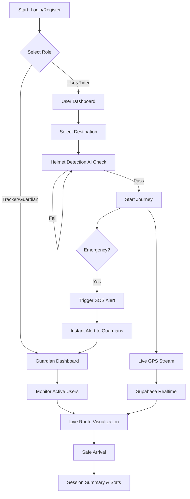

#  Smart Guardian: Unified Safety & Monitoring Ecosystem
**Finalist @ Hackathon 2026**


Smart Guardian is a state-of-the-art safety and real-time monitoring solution designed to provide comprehensive protection for users on the move. Built with technical excellence, it bridges the gap between proactive security and intuitive monitoring, earning it a prestigious spot in the **Hackathon Finals**.

---

##  Vision & Problem Statement
In an increasingly mobile world, personal safety and vehicle compliance are paramount. Smart Guardian addresses these challenges by offering a dual-interface ecosystem that empowers both the traveler and their guardian with real-time, actionable intelligence.

---

##  Key Technical Modules

###  Smart Guardian SOS
- **Instant Response**: One-tap emergency trigger system.
- **Broadcast System**: Concurrent alerting to all connected guardians with precise location telemetry.
- **Status Monitoring**: Active lifecycle management of emergency events.

###  Real-Time Live Tracking
- **Supabase Realtime**: Leverages PostgreSQL `Replication` for low-latency coordinate synchronization.
- **Dynamic Polylines**: Smooth route rendering and update cycles based on live movement.
- **Interactive Map Screen**: Integrated Google Maps SDK with optimized marker management.

###  AI-Driven Safety Compliance
- **Helmet Detection**: Integrated Computer Vision logic to ensure rider safety before journey commencement.
- **Safety Scoring**: Intelligent algorithm to rate rider behavior and compliance over time.

###  Guardian/Tracker Mode
- **Multi-User Monitoring**: Dedicated "Tracker" interface allowing guardians to oversee multiple profiles simultaneously.
- **Remote Messaging**: Direct communication channel between Tracker and User via Supabase.

---

## 🔄 Application Flow & Architecture



1.  **Onboarding**: Multi-role entry point (User or Tracker/Guardian).
2.  **Authentication**: Secure identity management via Supabase Auth.
3.  **Journey Lifecycle**:
    - **Initialization**: Destination selection and route calculation.
    - **Safety Check**: Mandatory Helmet Detection AI verification.
    - **Active Session**: Real-time GPS stream pushed to Supabase Realtime DB.
4.  **Guardian Oversight**: Trackers receive live updates on their dedicated dashboard, including SOS alerts and distance metrics.

---

##  Technology Stack & Skills

### **Core Frameworks**
- **Flutter (v3.x)**: For high-performance, cross-platform UI.
- **Dart**: Leveraging asynchronous programming and robust typing.

### **Backend & Infrastructure**
- **Supabase**: PostgreSQL database, Auth, and Realtime subscriptions.
- **Google Cloud Platform**: 
    - **Google Maps SDK**: For map rendering and geocoding.
    - **Directions API**: For intelligent route planning.

### **Integrated Services**
- **Flutter TTS (Text-to-Speech)**: For hands-free navigation alerts and safety warnings.
- **Geolocator**: Advanced GPS tracking and distance calculation.
- **PostgreSQL**: Complex RLS (Row Level Security) and Custom Functions for tracking logic.

---

## 🏁 Hackathon Success
> "Smart Guardian stands as a testament to innovative problem-solving, reaching the **Finals** by demonstrating technical robustness, real-world utility, and a seamless user experience."

---

## 💻 Getting Started

1.  **Clone the Repository**:
    ```bash
    git clone https://github.com/rajuperumalla951515/SmartGuardian_IM26.git
    ```
2.  **Configuration**:
    - Add your Google Maps API key to the specified placeholders in:
        - `lib/core/constants.dart`
        - `android/app/src/main/AndroidManifest.xml`
        - `ios/Runner/AppDelegate.swift`
        - `web/index.html`
3.  **Install Dependencies**:
    ```bash
    flutter pub get
    ```
4.  **Run Application**:
    ```bash
    flutter run
    ```
